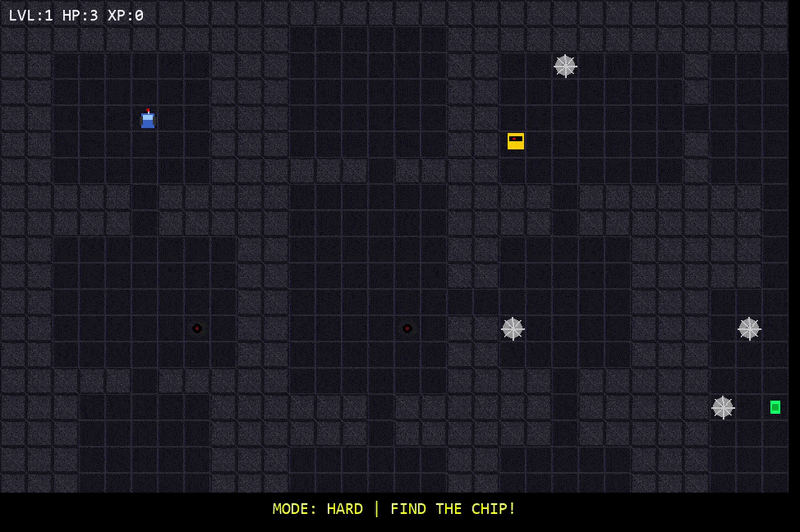

# Robot Quest 🤖

A dungeon crawler game built with Python and Pygame. Navigate procedurally generated dungeons, avoid traps, collect coins, and find the exit!

## Gameplay




## Features

- **Procedural Dungeon Generation** — Every level is randomly generated using BSP (Binary Space Partition)
- **Multiple Difficulty Modes** — Easy, Medium, and Hard
- **Enemies** — Patrol bots, turrets, laser gates, and a ghost that chases you
- **Save/Load System** — Save your progress and continue anytime
- **Level Select** — Replay any level you've unlocked
- **Procedural Pixel Art** — All sprites are generated in code

## Controls

| Key | Action |
|-----|--------|
| WASD / Arrow Keys | Move |
| K | Save game |
| L | Skip level (cheat) |
| ESC | Pause / Back to menu |

## How to Play

1. Find the **chip** (key) in the dungeon
2. Navigate to the **exit** (turns green when you have the chip)
3. Avoid spikes, turrets, patrol bots, laser gates, and the ghost
4. Collect coins for XP

## Running from Source

```bash
pip install pygame
python "ROBOT QUEST.py"
```

## Building the Executable

```bash
pip install pyinstaller
pyinstaller --onefile --noconsole --name "Robot Quest" --add-data "music;music" "ROBOT QUEST.py"
```

The `.exe` will be in the `dist/` folder.

## Credits

- **Game Design & Code** — Vansh Kumar
- **Procedural Art** — Pygame Pixel Generator
- **Tiles & Sprites** — Vansh Kumar
- **Game Music** — yt_Atmosphera, bfxr, mixkit
